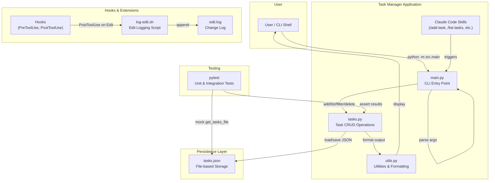
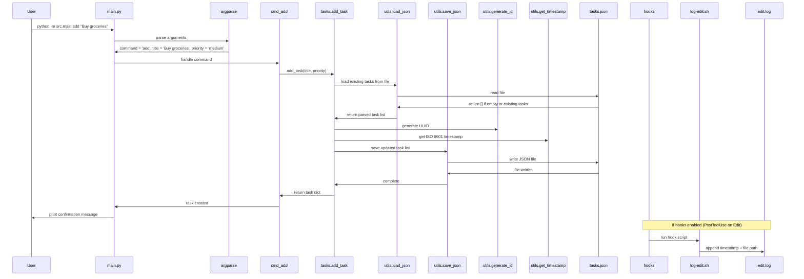
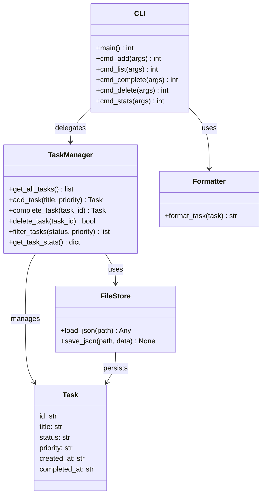
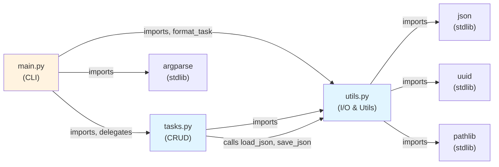

# Architecture: Task Manager CLI

> A lightweight Python command-line application for managing tasks with an emphasis on demonstrating Claude Code capabilities (skills, hooks, and project memory) rather than production-scale task management.

---

## High-Level Architecture

### System Overview

The Task Manager CLI is a single-user, file-based task management system designed primarily as a learning project for Claude Code concepts. It provides a simple but functional interface for creating, listing, filtering, and managing tasks. All data is persisted to a local JSON file (`data/tasks.json`), making it portable and easy to understand. The system demonstrates three key Claude Code patterns: custom skills (slash commands), hooks (event-driven automation), and project memory (CLAUDE.md), alongside standard CLI argument parsing and simple in-memory task filtering.

### Component Diagram



### Layers / Tiers

| Layer | Responsibility | Technology |
|-------|---------------|------------|
| **Presentation / CLI** | User interface via command-line arguments and formatted text output | Python argparse, print statements |
| **Application** | Command routing, argument validation, user-facing business logic | `src/main.py` (command handlers), input validation |
| **Domain / Task Logic** | Task CRUD operations, filtering, statistics, data model enforcement | `src/tasks.py` (core business logic) |
| **Utilities** | ID generation, timestamps, JSON serialization, formatting | `src/utils.py` |
| **Persistence** | File-based JSON storage; create directories if needed | `data/tasks.json` (local filesystem) |
| **Extensibility** | Custom commands and event-driven automation | Claude Code skills (`.claude/commands/`), hooks (`.claude/settings.json`) |
| **Testing** | Unit and integration tests with mocked file I/O | pytest, test fixtures, mocking |

### External Integrations

| System | Purpose | Protocol |
|--------|---------|----------|
| Claude Code | Skill execution (custom slash commands) | Markdown-based skill definitions |
| Claude Code | Hook execution (pre/post-operation events) | Shell commands via settings.json |
| Python stdlib | Core runtime (argparse, json, uuid, datetime, pathlib) | Standard library imports |
| pytest | Test execution and reporting | Command-line test runner |

### Data Flow

The primary happy-path data flow:

1. **User input** enters via CLI command (e.g., `python -m src.main add "Buy groceries"`)
2. **`main.py`** parses arguments using argparse and routes to the appropriate command handler (e.g., `cmd_add`)
3. **Command handler** delegates to **`tasks.py`** CRUD functions (e.g., `add_task()`)
4. **`tasks.py`** validates input, generates metadata (UUID, timestamp), and calls **`utils.py`** to load/save JSON
5. **`utils.py`** handles all file I/O: reads `data/tasks.json`, deserializes, modifies in-memory, serializes, and writes back
6. **Response** is formatted using `format_task()` and printed to stdout
7. **Hooks** (if enabled) capture the Edit event and log it to `data/edit.log` via `log-edit.sh`

For filtering/read-only operations (list, stats), steps are similar but skip the write phase.



### Infrastructure & Deployment

**Deployment Model:**
File-based, single-machine Python CLI. No server, database, or cloud infrastructure.

**Runtime:**
- Python 3.x (implied by async/await and type hints syntax)
- Virtual environment: `venv/` directory
- Dependencies: `requirements.txt` (pytest, typing-extensions, etc. as needed)

**Configuration:**
- `.claude/settings.json` — Defines Claude Code hooks and permissions
- `CLAUDE.md` — Project memory for consistent coding conventions
- `.claude/commands/` — Custom skill definitions (markdown)

**Data & Logging:**
- `data/tasks.json` — Persistent task storage
- `data/edit.log` — Append-only log of file edits (created by hooks)

**CI/CD:**
None currently configured. Testing is manual: `pytest tests/ -v`.

**Secrets:**
None (no authentication, APIs, or external services).

---

## Low-Level Architecture

### Directory Structure

```
claude-code-learning-project/
├── CLAUDE.md                          # Project memory: coding conventions, data schemas, key patterns
├── README.md                          # User-facing documentation and Claude Code concept explanations
├── requirements.txt                   # Python dependencies (pytest)
├── .gitignore                         # Git exclusions
│
├── .claude/                           # Claude Code configuration and skills
│   ├── settings.json                  # Hooks, permissions, configuration for Claude Code
│   └── commands/                      # Custom skills (slash commands)
│       ├── add-task.md                # /add-task skill definition
│       ├── list-tasks.md              # /list-tasks skill definition
│       ├── clear-tasks.md             # /clear-tasks skill definition
│       ├── summarize.md               # /summarize skill definition
│       └── test.md                    # /test skill definition
│
├── src/                               # Main application source code
│   ├── __init__.py                    # Package marker
│   ├── main.py                        # CLI entry point: argument parsing and command routing
│   ├── tasks.py                       # Core task CRUD operations and business logic
│   └── utils.py                       # Shared utilities: file I/O, formatting, ID generation
│
├── tests/                             # Pytest test suite
│   ├── __init__.py                    # Package marker
│   └── test_tasks.py                  # Unit tests for tasks module (TestUtils, TestTasks classes)
│
├── data/                              # Data directory
│   ├── tasks.json                     # Task storage (created/updated by app, mocked in tests)
│   └── edit.log                       # Append-only log of file edits (created by hooks)
│
├── scripts/                           # Hook scripts
│   └── log-edit.sh                    # PostToolUse hook: logs file edits to data/edit.log
│
├── docs/                              # Documentation
│   └── AI_ASSISTED_DEVELOPMENT_ARCHITECTURE.md  # Enterprise architecture patterns (reference)
│
└── venv/                              # Python virtual environment (excluded from git)
```

### Module Breakdown

#### CLI Entry Point — `src/main.py`

**Responsibility:** Parse command-line arguments, route to appropriate command handler, and format/display results.

**Key files:**
| File | Role |
|------|------|
| `src/main.py` | Command routing, user-facing error handling, output formatting |

**Exports / Public API:**
- `main() -> int` — Entry point; parses arguments and delegates to command handler. Returns 0 on success, 1 on error.
- `cmd_add(args) -> int` — Adds a new task; validates input and calls `tasks.add_task()`.
- `cmd_list(args) -> int` — Lists tasks with optional filters; calls `tasks.filter_tasks()`.
- `cmd_complete(args) -> int` — Marks a task as completed.
- `cmd_delete(args) -> int` — Deletes a task.
- `cmd_stats(args) -> int` — Displays task statistics.

**Internal design:**
Uses Python's `argparse` to define subparsers for each command (add, list, complete, delete, stats). Each subparser has its own argument definitions (e.g., `--priority`, `--status`). Command handlers are bound to parsers via `set_defaults(func=...)`. The main function parses arguments, checks if a command is present, and calls `args.func(args)` to invoke the handler. Error handling is minimal: exceptions are caught and printed to stderr with exit code 1.

---

#### Task Management — `src/tasks.py`

**Responsibility:** All task CRUD operations, filtering, and statistics. This is the domain/business logic layer.

**Key files:**
| File | Role |
|------|------|
| `src/tasks.py` | Task creation, reads, updates, deletion, filtering, stats |

**Exports / Public API:**
- `get_all_tasks() -> list[dict]` — Load and return all tasks from `tasks.json`.
- `get_task_by_id(task_id: str) -> dict | None` — Find a task by full or partial ID (prefix match).
- `add_task(title: str, priority: str = "medium") -> dict` — Create a new task with UUID, timestamp, default status "pending".
- `update_task(task_id: str, **updates) -> dict | None` — Update allowed fields (title, status, priority); auto-set `completed_at` if status → "completed".
- `complete_task(task_id: str) -> dict | None` — Mark a task as completed (via `update_task`).
- `delete_task(task_id: str) -> bool` — Remove a task by ID.
- `filter_tasks(status: str | None = None, priority: str | None = None) -> list[dict]` — Return tasks matching optional filters.
- `get_task_stats() -> dict` — Return counts of total, pending, in_progress, completed, and high-priority tasks.

**Internal design:**
All task operations are stateless functions that load the full task list, modify in-memory, and save back to disk. This ensures strong consistency but is not optimized for large datasets. Validation happens early (e.g., `add_task` rejects empty titles and invalid priorities). Partial ID matching (`task_id.startswith()`) allows users to reference tasks by short prefixes. The `update_task` function restricts which fields can be modified (`allowed_fields`) to prevent accidental changes to metadata like `id` or `created_at`.

---

#### Utilities — `src/utils.py`

**Responsibility:** Shared utility functions for file I/O, ID generation, timestamps, and task formatting.

**Key files:**
| File | Role |
|------|------|
| `src/utils.py` | JSON I/O, UUID generation, formatting, path resolution |

**Exports / Public API:**
- `get_data_path() -> Path` — Return the path to the `data/` directory.
- `get_tasks_file() -> Path` — Return the path to `data/tasks.json`.
- `generate_id() -> str` — Generate a UUID string.
- `get_timestamp() -> str` — Return current time in ISO 8601 format.
- `load_json(filepath: Path) -> Any` — Load JSON from file; return empty list `[]` if file does not exist.
- `save_json(filepath: Path, data: Any) -> None` — Save data to JSON file; create parent directories if needed.
- `format_task(task: dict) -> str` — Format a task for display with status icon (`[ ]`, `[~]`, `[x]`) and priority markers (empty, `*`, `**`).

**Internal design:**
Path resolution uses `Path(__file__).parent.parent / "data"` to find the data directory relative to the source code. This makes the app relocatable. JSON I/O is defensive: `load_json` returns `[]` rather than raising an exception if the file is missing, enabling the app to initialize with an empty task list. The `format_task` function applies simple formatting rules: status icons and priority markers are hardcoded in dictionaries, and the full task ID is truncated to 8 characters for readability.

---

#### Testing — `tests/test_tasks.py`

**Responsibility:** Unit and integration tests for the task module using pytest.

**Key files:**
| File | Role |
|------|------|
| `tests/test_tasks.py` | Comprehensive test suite with two test classes |

**Test Classes:**
- **`TestUtils`** — Tests for utility functions (ID generation, timestamps, formatting).
  - `test_generate_id_returns_string()` — Verify UUID format.
  - `test_generate_id_unique()` — Ensure 100 generated IDs are unique.
  - `test_get_timestamp_format()` — Verify ISO 8601 format.
  - `test_format_task_pending()` — Check formatting of pending task.
  - `test_format_task_completed()` — Check formatting of completed task.

- **`TestTasks`** — Tests for task CRUD and filtering.
  - `test_add_task()` — Add a task and verify default values.
  - `test_add_task_with_priority()` — Add task with custom priority.
  - `test_add_task_empty_title_raises()` — Verify ValueError on empty title.
  - `test_add_task_invalid_priority_raises()` — Verify ValueError on invalid priority.
  - `test_get_all_tasks()` — Verify loading multiple tasks.
  - `test_complete_task()` — Verify status change and `completed_at` set.
  - `test_delete_task()` — Verify task removal.
  - `test_filter_tasks_by_status()` — Verify filtering by status.
  - `test_get_task_stats()` — Verify statistics counts.

**Test Pattern:**
Each test uses a `temp_tasks_file` fixture that creates a temporary JSON file and patches `src.tasks.get_tasks_file()` to return that path instead of the real `data/tasks.json`. This isolation prevents test runs from interfering with actual data. Tests are simple and focused: they call the function under test, assert results, and clean up automatically.

---

### Class / Type Diagram



### Key Data Models

#### Task

```python
{
    "id": str,                # UUID string (e.g., "b2c3d4e5-f6a7-8901-bcde-f12345678901")
    "title": str,             # Task title; required, non-empty
    "status": str,            # One of: "pending", "in_progress", "completed"
    "priority": str,          # One of: "low", "medium", "high"
    "created_at": str,        # ISO 8601 timestamp (e.g., "2024-01-15T11:00:00")
    "completed_at": str | null # ISO 8601 timestamp or null if not yet completed
}
```

The Task data structure is the central domain model. It represents a single task with metadata for tracking, prioritization, and lifecycle state. The `id` field is immutable (enforced by validation in `update_task`). The `created_at` and `completed_at` timestamps are automatic and managed by the system. Status and priority follow a fixed set of enum values.

---

### API Surface

The application is a CLI, not a REST/GraphQL API. However, the command-line interface functions as the "API":

| Command | Syntax | Description |
|---------|--------|-------------|
| add | `add <title> [-p \|--priority {low\|medium\|high}]` | Create a new task |
| list | `list [-s \|--status {pending\|in_progress\|completed}] [-p \|--priority {low\|medium\|high}]` | List tasks with optional filters |
| complete | `complete <task_id>` | Mark task as completed |
| delete | `delete <task_id>` | Delete a task |
| stats | `stats` | Display task statistics |

Example invocations:
```bash
python -m src.main add "Learn Python"
python -m src.main list --status pending
python -m src.main list --priority high
python -m src.main complete b2c3d4e5  # Partial ID
python -m src.main stats
```

---

### Event / Message Bus

The application uses **hooks** rather than a true event bus. Hooks are defined in `.claude/settings.json`:

| Hook | Trigger | Consumer | Action |
|------|---------|----------|--------|
| PreToolUse (Bash) | Before any Bash command | stderr | Echo "[Hook] About to run Bash command" |
| PostToolUse (Edit) | After a file is edited in Claude Code | `log-edit.sh` | Append edit record to `data/edit.log` |

These hooks are part of Claude Code's infrastructure, not the application itself. The `log-edit.sh` script reads the hook input as JSON (via stdin), extracts the file path, and appends a timestamped log entry.

---

### Dependency Graph



**Key Observations:**
- **No circular dependencies.** The dependency graph is acyclic: CLI → Tasks → Utils → stdlib.
- **Tight cohesion.** Utils is a true utility module with no business logic; Tasks is the domain logic; Main is the presentation layer.
- **Testable.** Each module depends only on imports and function calls, making it easy to mock file I/O for testing.
- **Minimal external dependencies.** Only pytest is required beyond the Python standard library.

---

### Cross-Cutting Concerns

| Concern | Approach | Location |
|---------|----------|----------|
| **Error Handling** | Try-catch in command handlers; ValueError for validation; simple stderr messages | `src/main.py` (cmd_* functions) |
| **Logging** | Hook-based append-only log of file edits | `scripts/log-edit.sh`, `data/edit.log` |
| **Validation** | Input validation at the API boundary (tasks.add_task, etc.) | `src/tasks.py` (add_task, update_task) |
| **Configuration** | Project memory (CLAUDE.md) + Claude Code settings (settings.json) | `/CLAUDE.md`, `.claude/settings.json` |
| **Data Persistence** | Defensive JSON I/O with auto-directory creation | `src/utils.py` (load_json, save_json) |
| **Testing** | Pytest + fixture-based mocking of file I/O | `tests/test_tasks.py`, temp_tasks_file fixture |
| **Code Style** | PEP 8 conventions + project-specific rules (100-char line length) | Enforced via CLAUDE.md |

---

## Key Design Decisions

1. **File-Based Storage Over Database** — Tasks are stored in a single `tasks.json` file rather than a relational database. This is appropriate for a learning project but limits scalability. **Trade-off:** Simplicity and zero dependencies vs. poor performance at scale and no concurrent-write safety. This decision reflects the project's educational focus rather than production requirements.

2. **Stateless, Load-All-Modify-Save Pattern** — Every task operation reads the entire task list, modifies it in-memory, and writes the whole list back. This ensures strong consistency but is inefficient. **Trade-off:** Implementation simplicity and correctness vs. O(n) memory usage and disk I/O per operation. Acceptable for small task lists; would require refactoring for millions of tasks.

3. **Partial ID Matching** — Task IDs can be referenced by their first N characters (e.g., `b2c3d4e5` instead of the full UUID). **Trade-off:** Convenience for CLI users vs. risk of ambiguous matches (mitigated by app behavior: first match wins). Adds minor complexity to the lookup logic.

4. **Validation at the CRUD Layer** — Input validation (e.g., non-empty title, valid priority) happens in `tasks.py`, not in the CLI. **Trade-off:** Cleaner separation of concerns (CLI is thin) vs. less context for error messages (CLI doesn't know the validation rules). The trade-off favors domain-driven design.

5. **Minimal CLI Framework** — Uses only Python's built-in `argparse` rather than a third-party CLI library (Click, Typer, etc.). **Trade-off:** Zero dependencies and full control vs. boilerplate code for argument parsing and command routing. Appropriate for simplicity; would use Click for a more complex CLI.

6. **Extensibility via Claude Code Skills & Hooks** — Custom commands and automation are defined in markdown (`.claude/commands/`) and shell scripts (`.claude/settings.json`, `scripts/`), not as Python code. **Trade-off:** Non-developers can extend the system without touching code; forces tight integration with Claude Code. This is a pedagogical choice to demonstrate Claude Code's capabilities.

---

## Known Limitations & Technical Debt

1. **No Concurrent Write Safety** — Multiple processes writing to `tasks.json` simultaneously will corrupt data or lose updates. The app uses no file locking. **Fix:** Add file locking (fcntl on Unix) or migrate to a database with ACID guarantees.

2. **Ambiguous Task ID Matching** — If two tasks have IDs starting with the same prefix (unlikely with UUIDs but theoretically possible), the app will match the first one. **Fix:** Require longer prefixes or throw an error on ambiguity.

3. **No Data Validation on Load** — `load_json` does not validate the schema of tasks read from disk. A malformed `tasks.json` will cause runtime errors. **Fix:** Add schema validation (jsonschema library) and graceful error handling.

4. **No Undo/Deletion Recovery** — Deleted tasks are gone forever. **Fix:** Soft deletes (mark as deleted, archive to backup file) or trash bin pattern.

5. **Limited Statistics** — `get_task_stats` is hardcoded; no custom aggregations. **Fix:** Query language or pluggable stats functions.

6. **Single-User Only** — No multi-user support, no user accounts, no permissions. **Fix:** Add user table and scoping (well beyond scope).

7. **No Persistence of Edit Log** — The `data/edit.log` is append-only but never rotated or pruned. It will grow indefinitely. **Fix:** Log rotation (e.g., daily rollover to `edit.log.YYYY-MM-DD`).

8. **Incomplete Hook Configuration** — The `PostToolUse` hook script (`log-edit.sh`) relies on `jq` for JSON parsing, which must be installed separately. If `jq` is missing, the hook silently fails. **Fix:** Use Python for hook scripts or document the dependency.

9. **No CLI Help for Subcommands** — Running `python -m src.main add --help` works, but there's no overview of all commands without running with no args. The help output could be more discoverable. **Fix:** Improve argparse configuration or add a dedicated help command.

10. **Skills Not Integrated with Python** — Claude Code skills (in `.claude/commands/`) shell out to Python and parse output as text. There's no bidirectional communication or structured data exchange. **Fix:** Use Claude Code's SDK (if available) for deeper integration, or define an API contract in JSON.

---

## Glossary

| Term | Definition |
|------|------------|
| **Task** | A unit of work with a title, status, priority, and timestamps. The central data model. |
| **Status** | The lifecycle state of a task: "pending" (not started), "in_progress" (active), or "completed" (done). |
| **Priority** | The importance of a task: "low", "medium", or "high". Used for filtering and display. |
| **Partial ID** | A prefix of a task's full UUID, used for convenience in CLI commands (e.g., `b2c3d4e5` instead of the full UUID). |
| **Hook** | An event-driven automation in Claude Code that executes shell commands at specific points (e.g., after a file is edited). |
| **Skill** | A custom slash command in Claude Code, defined in markdown, that extends Claude's capabilities in the context of this project. |
| **Project Memory** | The `CLAUDE.md` file that provides persistent context (coding conventions, data schemas, patterns) across Claude Code sessions. |
| **CRUD** | Create, Read, Update, Delete — the four basic operations on data. |
| **Stateless** | A function or module that does not retain state between calls; all context is passed as arguments. |
| **Load-All-Modify-Save** | A pattern where every write operation loads the entire dataset, modifies it in-memory, and saves it back. Simple but inefficient at scale. |
