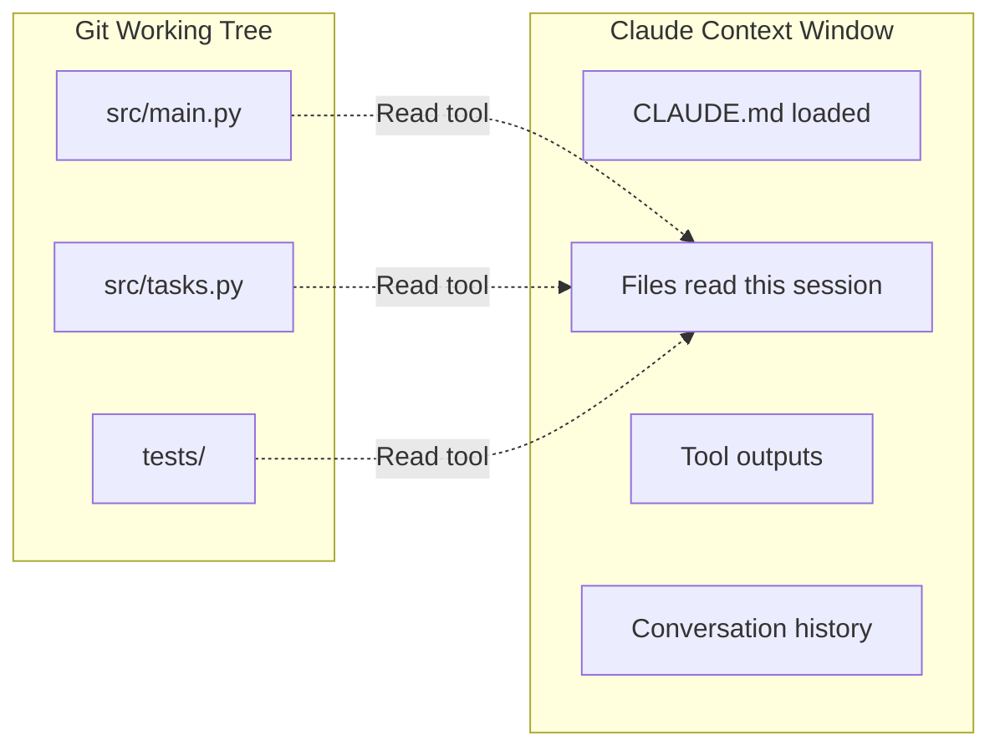
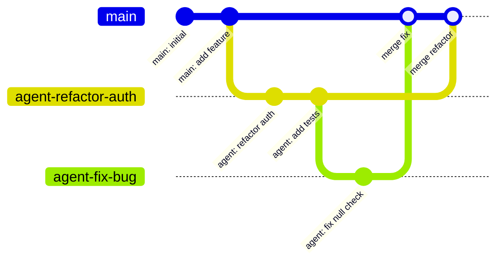
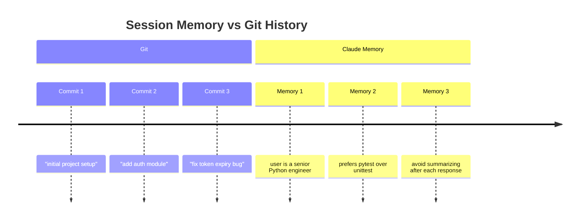
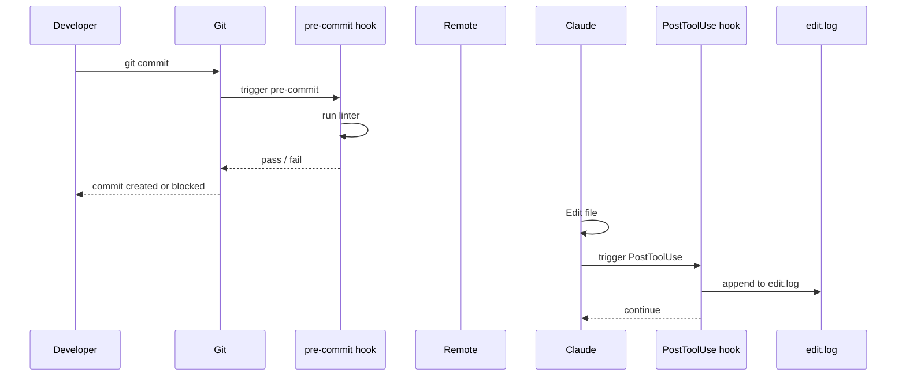
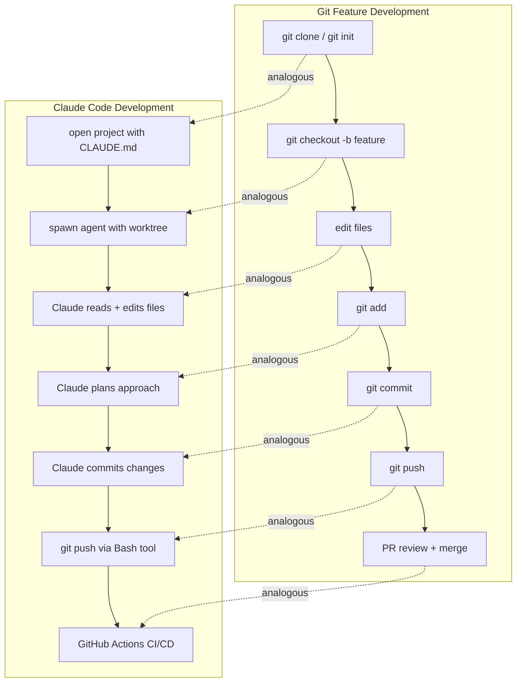

# Claude Code Development: A Git Analogy

> If you already think in git, you already understand Claude Code.
> This guide maps every Claude Code concept to a git concept you know.

---

## The Core Mental Model

```
┌─────────────────────────────────────────────────────────────────────┐
│                         GIT                                         │
│                                                                     │
│  repo ──── branch ──── working tree ──── staging ──── commit       │
│    │           │             │               │            │         │
│  remote      HEAD          diff           add .        history      │
│    │           │             │               │            │         │
│  push/pull   checkout      changes        intent       snapshot     │
└──────────────────────────────────────────────────────────────────┬──┘
                                                                   │
                                              same mental model    │
                                              different execution  │
                                                                   │
┌──────────────────────────────────────────────────────────────────▼──┐
│                       CLAUDE CODE                                   │
│                                                                     │
│  project ── agent/wt ── context window ── active task ── memory    │
│    │            │             │               │              │      │
│  tools        prompt        tool use       current        CLAUDE.md │
│    │            │             │               │              │      │
│  call        fork         file reads       doing X        persisted │
└─────────────────────────────────────────────────────────────────────┘
```

---

## Concept-by-Concept Mapping

### 1. Repository = Project + CLAUDE.md

In git, a **repository** is the complete history and state of a project.
In Claude Code, the **project** is the working directory plus `CLAUDE.md` — the file that gives Claude persistent context across sessions.

```
GIT                             CLAUDE CODE
─────────────────────────────────────────────────────
.git/                     ←→    .claude/
  config                  ←→      settings.json (hooks, permissions)
  HEAD                    ←→      current session context
  COMMIT_EDITMSG          ←→      last instruction
README.md                 ←→    CLAUDE.md (project memory)
```

**Key insight:** Just like `git clone` gives a new developer everything they need to understand the project's history, `CLAUDE.md` gives Claude everything it needs to understand your project's conventions, structure, and goals — even in a brand new session.

---

### 2. Working Tree = Context Window

The **working tree** in git is what you can see and edit right now — the live state of files on disk. Claude's **context window** is exactly the same: what Claude can "see" right now in the conversation.

```
GIT Working Tree                Claude Context Window
────────────────────────        ──────────────────────────────────
Files on disk                   Files read in this session
Unstaged changes                Tool outputs so far
Current state of src/           Current state of the conversation

git status                ←→    /context  (shows token usage)
git diff                  ←→    tool results (what changed)
```

**Key insight:** Just like a git working tree has a limited view (only the checked-out branch), Claude's context window has a limit (200k tokens). When it fills up, auto-compaction happens — similar to how `git gc` cleans up history to keep the repo efficient.



---

### 3. Branch = Agent / Worktree Isolation

In git, a **branch** is an isolated line of work. You create a branch to work on a feature without affecting `main`. In Claude Code, launching an agent with `isolation: "worktree"` does exactly this — it creates a git worktree so the agent works on an isolated copy of the repo.

```
GIT                             CLAUDE CODE
─────────────────────────────────────────────────────
git checkout -b feature/x ←→   Agent(isolation: "worktree")
git branch                ←→   running agents list
git merge feature/x       ←→   review + apply agent's changes
git branch -d feature/x   ←→   worktree cleaned up after agent done
```



**Key insight:** Multiple agents running in parallel = multiple git branches active simultaneously. Each agent is isolated, works independently, and you merge (review + accept) their changes back to main.

---

### 4. Staging Area = Active Task Focus

In git, the **staging area** (`git add`) is where you collect changes you intend to commit — a deliberate act of "I'm about to do this." In Claude Code, the **active task** (what Claude is currently focused on executing) plays the same role. When Claude reads files and plans its approach before editing, that's the staging phase.

```
GIT                             CLAUDE CODE
─────────────────────────────────────────────────────
git add src/main.py       ←→   Read("src/main.py") — scoping the work
git add -p                ←→   reviewing each change before applying
git diff --staged         ←→   Claude's plan before executing
git reset HEAD            ←→   "stop, let me reconsider"
```

---

### 5. Commit = Memory Snapshot

A **git commit** is a permanent, named snapshot of state with a message explaining why. Claude's **memory system** (files in `.claude/projects/*/memory/`) is exactly this — snapshots of context that persist across sessions.

```
GIT                             CLAUDE CODE
─────────────────────────────────────────────────────
git commit -m "message"   ←→   Write memory file with context
git log                   ←→   reading memory files
git show <hash>           ←→   reading a specific memory file
git stash                 ←→   temporary in-session notes
COMMIT_EDITMSG            ←→   last memory entry
```



**Key insight:** Just like git log lets a new team member understand why decisions were made, Claude's memory lets a new session pick up exactly where the last one left off — without re-explaining everything.

---

### 6. Git Hooks = Claude Hooks

**Git hooks** are scripts that run automatically on git events (`pre-commit`, `post-commit`, `pre-push`). **Claude hooks** are shell commands that run automatically on Claude tool events (`PreToolUse`, `PostToolUse`).

```
GIT                             CLAUDE CODE
─────────────────────────────────────────────────────
.git/hooks/pre-commit     ←→   PreToolUse hook (Bash)
.git/hooks/post-commit    ←→   PostToolUse hook (Edit)
husky / lefthook          ←→   .claude/settings.json hooks config
lint-staged               ←→   hook filtering by tool type
```



---

### 7. Remote = External Tools

In git, the **remote** (GitHub, GitLab) is the external system Claude interacts with via `push` and `pull`. In Claude Code, **tools** (Bash, GitHub CLI, APIs) are the external systems Claude interacts with via tool calls.

```
GIT                             CLAUDE CODE
─────────────────────────────────────────────────────
git push origin main      ←→   Bash("git push origin main")
git pull                  ←→   Bash("git fetch && git merge")
gh pr create              ←→   Bash("gh pr create ...")
git fetch --tags          ←→   WebFetch / WebSearch
```

---

### 8. Tags = Pinned Checkpoints

**Git tags** mark important, stable points in history (`v1.0.0`, `v2.0.0`). In Claude Code, **project memory entries** tagged with decisions or milestones serve the same purpose — stable reference points you return to.

```
GIT                             CLAUDE CODE
─────────────────────────────────────────────────────
git tag v1.0.0            ←→   memory: "released v1.0.0 on 2026-03-26"
git checkout v1.0.0       ←→   re-reading a specific memory file
git describe --tags       ←→   checking memory for last milestone
```

---

## Full Lifecycle Comparison



---

## The "Git for Claude" Cheat Sheet

| Git Concept | Git Command | Claude Code Equivalent |
|------------|------------|----------------------|
| Initialize repo | `git init` | Open project, Claude reads `CLAUDE.md` |
| Project memory | `README.md` + `.git/` | `CLAUDE.md` + `.claude/` |
| Working tree | files on disk | context window (what Claude sees) |
| Context limit | disk space | 200k token window |
| Branch | `git checkout -b` | `Agent(isolation: "worktree")` |
| Parallel branches | multiple branches | multiple parallel agents |
| Merge | `git merge` | review + apply agent output |
| Stage changes | `git add` | Claude reads files before editing |
| Commit | `git commit` | write to memory system |
| Commit history | `git log` | memory files index (`MEMORY.md`) |
| Stash | `git stash` | in-session notes (not persisted) |
| Tag | `git tag v1.0.0` | milestone memory entry |
| Pre-commit hook | `.git/hooks/pre-commit` | `PreToolUse` hook in `settings.json` |
| Post-commit hook | `.git/hooks/post-commit` | `PostToolUse` hook in `settings.json` |
| Remote | `origin` (GitHub) | Bash tool, gh CLI, WebFetch |
| Push | `git push` | `Bash("git push origin main")` |
| CI/CD pipeline | GitHub Actions | GitHub Actions (same!) |
| Code review | PR review | Generator + Critic agent pattern |
| `git gc` | compacts history | auto-compaction at context limit |
| `.gitignore` | ignores files | permissions in `settings.json` |
| `git blame` | who changed what | `git log` via Bash tool |

---

## Mental Model Summary

```
┌────────────────────────────────────────────────────────────────────┐
│                                                                    │
│  Think of Claude as a developer who...                            │
│                                                                    │
│  • Reads CLAUDE.md like a new dev reads the README                │
│  • Creates a branch (worktree) before making changes              │
│  • Stages changes (reads context) before committing (editing)     │
│  • Writes commit messages (memory) so future-Claude remembers     │
│  • Uses hooks to automate repetitive tasks                        │
│  • Treats tools like remotes — external systems to push/pull to   │
│  • Runs parallel agents like parallel feature branches            │
│  • Merges agent work back just like merging a PR                  │
│                                                                    │
│  The difference: instead of a developer typing commands,          │
│  Claude reasons about what commands to run and runs them.         │
│                                                                    │
└────────────────────────────────────────────────────────────────────┘
```

---

## Practical Implications

### Write CLAUDE.md like you write a CONTRIBUTING.md

The more context you give in `CLAUDE.md`, the less you repeat yourself across sessions. Treat it like onboarding documentation for a new (very capable) team member.

### Spawn agents like you branch for features

Don't do everything in one session. Use agents with worktree isolation for independent work streams — same reason you don't do all your feature work on `main`.

### Use memory like you write commit messages

When you discover something non-obvious — a quirk in the codebase, a preference, a decision — save it to memory. Future sessions will thank you, just like future developers thank you for good commit messages.

### Hooks are your pre-commit checks

If you want Claude to always do something before or after a tool use (log it, validate it, notify you), write a hook. Same muscle memory as setting up `husky` for your team.
